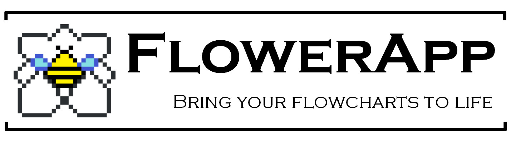
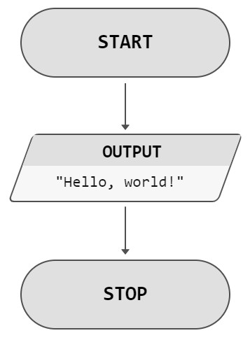
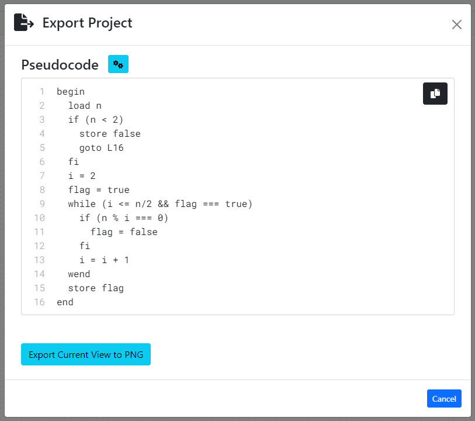
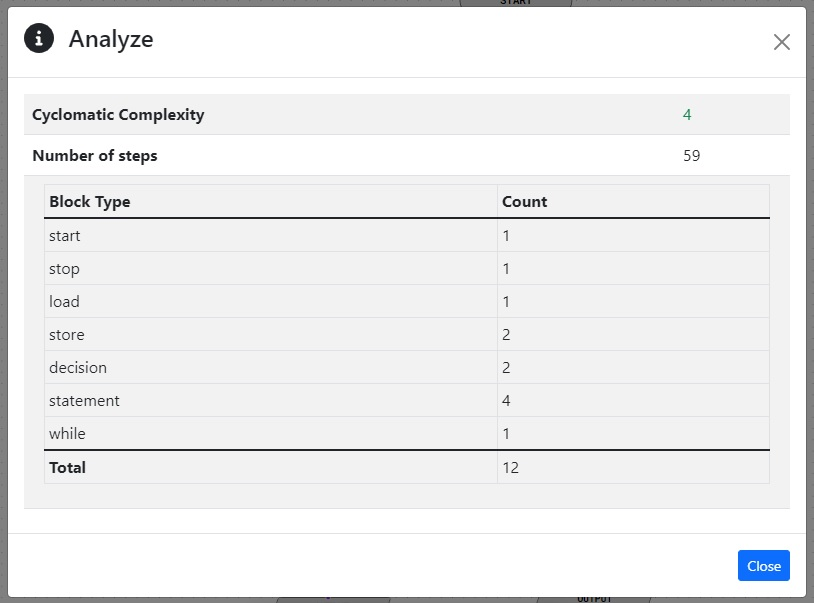

> *Create, run, analyze and export your flowcharts.*

[Click here to visit application!](http://web.itu.edu.tr/~ozkanbe19/flower-app/)

# Introduction

This project aims to reduce the understanding time and debugging process of procedural algorithms by providing following features:

 - **Designing:** Realize your algorithm by adding statements, decisions, loops and subroutines into your flowchart.
 - **Testing:** With the help of the built-in debugger, you can test your algorithm with given inputs! You can inspect the changes in variables, step-by-step.
 - **Analysis:** Use the metrics to optimize your algorithm such as [cyclomatic complexity](https://en.wikipedia.org/wiki/Cyclomatic_complexity), how many steps required and how many blocks it has.
 - **Exporting:** After finishing your design, you can export them into pseudo-code and PNG images! Generated pseudo-code and image can be used for documentation.
 - **Saving and Loading:** You can download your work and share it. This way, you can save your progress. Moreover, you can *use these project files directly in your flowcharts as subroutines!*
 - **Completely Client-side:** Just like a native application but on a browser. No server-side logic.
 - **PWA:** Use as desktop or mobile application. Click to "Install FlowerApp" when you visit the site and use FlowerApp anywhere, anytime.

## Why use FlowerApp?

1. No installation required.
2. Easy to learn. Just select the blocks, write very simple statements and connect them.
3. Helps to understand procedural algorithms.
4. Ability to test and export your algorithms. You can export them as pseudo-code out of the box.
5. It can be run on all modern browsers.

Even though you can write anything you want into the blocks (an abstract flowchart), if you want to run your flowchart, you have to follow *FlowerApp syntax* which is very similar to JavaScript. It is so similar that it may be a great start to learning JavaScript!

#  How to use?

> [In-App Help Page](https://web.itu.edu.tr/~ozkanbe19/flower-app/how-to.html)

# Screenshots

Below program shows the designing and testing the algorithm for "prime number checker".

Here is the *generated* pseudo-code of this program by FlowerApp:

Analysis of the algorithm for the input `37` as in the GIF:

------

# Background

In a case study [^1] about teaching programming to students, 40% of the students used pseudocode to understand the programming, 40% of them used a flowchart and the remaining 20% used a real language. Moreover, all of the students (100%) wanted to test and see the results of their programs to see what their program does or should do.

This work aims to make it easy to learn for at least 80% of
the students new to programming.

From the user's perspective, FlowerApp has an easy learning curve due to its simple instruction set and realizing the algorithms they wrote.

The developers can easily implement new features because of the abstractions and design patterns used during development.

## Similar applications

### MIT Scratch

Scratch is very similar in terms of placing blocks to create a program. It has also web support and high quality visuals. But, it is generally used for interactive animations. Great tool but not suitable for higher-level educational purposes.

> Scratch is a high-level block-based visual programming language and website aimed primarily at children as an educational tool for programming, with a target audience of ages 8 to 16.
>
> -- Wikipedia

### BlueJ

A great tool to learn object-oriented programming and Java. It uses UML-like class diagrams as building blocks and provides a simple interface. But, it is mainly for object-oriented programming and you need to install the IDE, meaning no web support.

> BlueJ is an integrated development environment for the Java programming language, developed mainly for educational purposes, but also suitable for small-scale software development. It runs with the help of Java Development Kit.
>
> -- Wikipedia

## References

[^1]:  M. Hu, “A case study in teaching adult students computer programming,” in Proceedings of the 16th Annual NACCQ, vol. 287. Citeseer, 2003. 